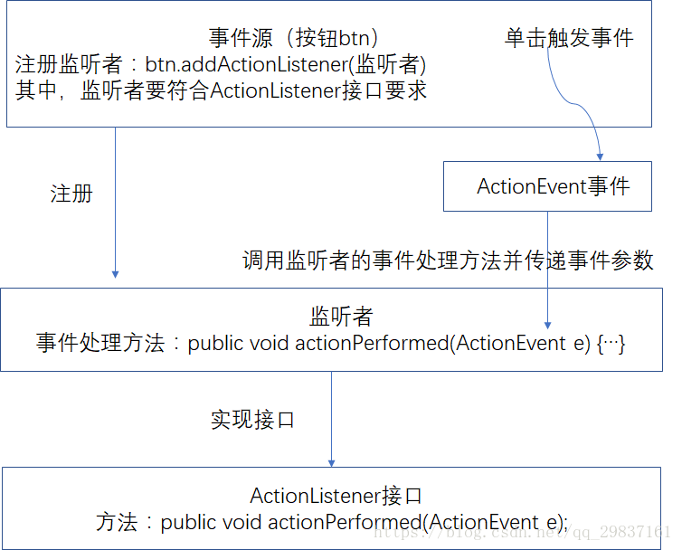
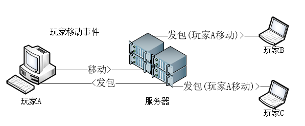

# 多人游戏的运作原理

### 启动 xxx.jar 时发生了什么?

1.  服务器开始预加载插件 [Load]

2.  服务器开始加载地图

3.  服务器开始加载插件[Enable]

4.  允许玩家接入

笼统的来说就以上四步...

插件是由 load 部分开始加载 此时会触发插件的Load事件

### 事件处理机制

这是传统开发的过程

以玩家移动举例

玩家A客户端发出移动->服务器收到包后就会处理移动,并且触发移动事件

服务器再把处理过的移动发送给所有玩家

插件就是在服务器环节进行干涉,比如取消移动,再比如减速等等...

### 了解什么是BukkitAPI

Minecraft是个闭源项目,所以无法直接操作MC的核心
BukkitAPI应运而生,创始者是MD5他制作了BukkitAPI让封闭的mc进行了开放 
在此之后 Spigot , Paper 也继承了BukkitAPI进行开发,就有了如今的生态环境...

### 了解Java? 不! 了解Kotlin
Kotlin的构思其实在2010年就已经初具规模,进几年因为 Bkm016(坏黑) 和 海螺 
编写的TabooLib才正式进入到MC圈子里...

####那什么是Java呢?
Java介于编译型语言和解释型语言之间。编译型语言如C、C++，代码是直接编译成机器码执行，
但是不同的平台（x86、ARM等）CPU的指令集不同， 因此，需要编译出每一种平台的对应机器码。
解释型语言如Python、Ruby没有这个问题，可以由解释器直接加载源码然后运行，
代价是运行效率太低。而Java是将代码编译成一种“字节码”，它类似于抽象的CPU指令，
然后，针对不同平台编写虚拟机，不同平台的虚拟机负责加载字节码并执行，
这样就实现了“一次编写，到处运行”的效果。当然，这是针对Java开发者而言。
对于虚拟机，需要为每个平台分别开发。为了保证不同平台、不同公司开发的虚拟机都能正确执行Java字节码，
SUN公司制定了一系列的Java虚拟机规范。从实践的角度看，JVM的兼容性做得非常好，
低版本的Java字节码完全可以正常运行在高版本的JVM上。
#### 既然java这么好为什么要用Kotlin?
+ 完全兼容Java
+ 空安全
+ 支持lambda表达式（比Java8更好）
+ 拓展函数
+ 函数式编程

#### 了解载体 TabooLib
既然要使用Kotlin就要导入Kotlin的运行库,
当然,不需要自己去打包,我们可以使用TabooLib来作为依赖进行制作kt插件

https://wiki.ptms.ink/index.php?title=TabooLib

